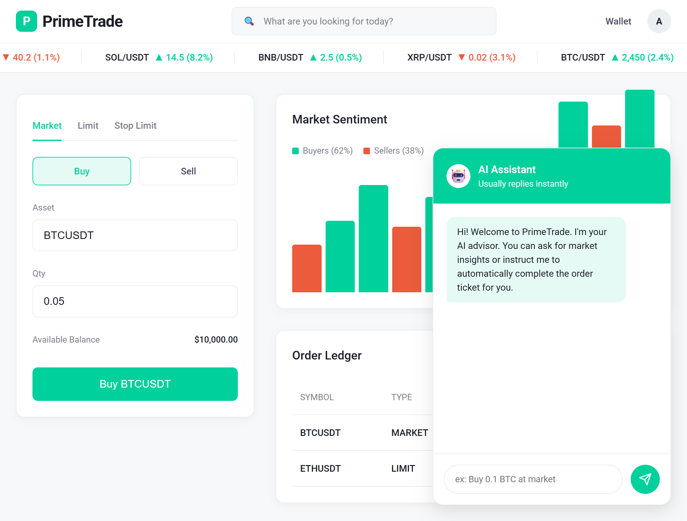
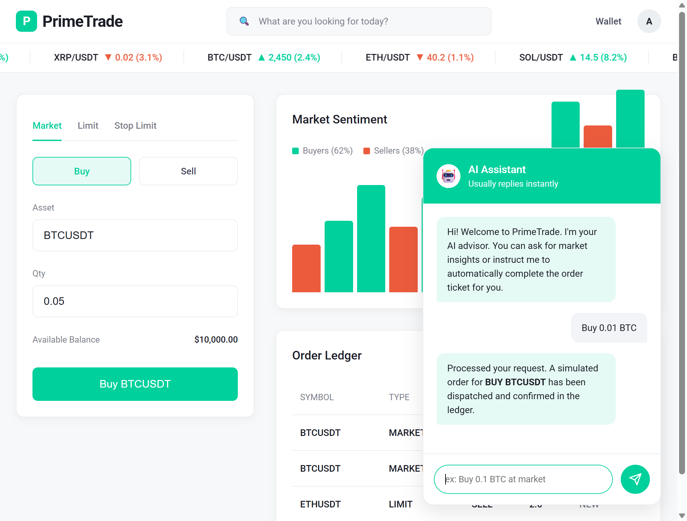

# ⚡ PrimeTrade Bot (Binance Futures Testnet)


A professional, CLI-based Python trading bot that places structured orders on the Binance Futures Testnet (USDT-M), enhanced with purely static UI dashboard visualization and OpenAI integration for risk advisory.

## Features
*   ✅ **Market, Limit, Stop-Limit orders**
*   ✅ **Full CLI with confirmation prompts**
*   ✅ **Structured logging to file + console**  
*   ✅ **Input validation with clear error messages**
*   ✅ **Web dashboard UI** (Sleek dark-mode visual interface with pure CSS animations)
*   ✅ **Testnet safe** — strictly operates on test funds
*   🤖 **OpenAI Risk Advisory** — Get AI-powered context for your trades directly in the CLI

---

## UI Overhaul Preview

### Dashboard Overview


### Conversational AI Integration


---

## Setup Instructions

1. **Clone Repo / Navigate to Directory:**
   ```bash
   cd "trading_bot"
   ```

2. **Setup Virtual Environment:**
   ```bash
   python -m venv venv
   # Windows:
   venv\Scripts\activate
   # Mac/Linux:
   source venv/bin/activate
   ```

3. **Install Dependencies:**
   ```bash
   pip install -r requirements.txt
   ```

4. **Environment Variables:**
   Create a `.env` file in the root directory and add your keys (see `.env.example`):
   ```ini
   API_KEY=your_binance_api_key
   API_SECRET=your_binance_api_secret
   OPENAI_API_KEY=your_openai_api_key
   ```
   *To get Binance Testnet credentials: Go to [Binance Futures Testnet](https://testnet.binancefuture.com) and sign in/register, scroll down to API Keys area.*

---

## Usage Examples

You can run the bot commands directly through the robust CLI interface.

**1. Check Connection**
```bash
python cli.py check-connection
```

**AI Advisory Preview**
Every place-order command automatically shows:
- 🤖 AI Risk Advisory BEFORE placing (powered by GPT-3.5)
- 🤖 AI Order Summary AFTER placing
No extra flags needed — it runs automatically if OPENAI_API_KEY is set in .env

**2. Place a MARKET Buy Order**
```bash
python cli.py place-order --symbol BTCUSDT --side BUY --type MARKET --quantity 0.01
```

**3. Place a LIMIT Sell Order**
```bash
python cli.py place-order --symbol ETHUSDT --side SELL --type LIMIT --quantity 0.1 --price 3000
```

**4. Place a STOP_LIMIT Buy Order**
```bash
python cli.py place-order --symbol BTCUSDT --side BUY --type STOP_LIMIT --quantity 0.01 --price 95000 --stop-price 94500
```

**5. Check Order Status**
```bash
python cli.py order-status --symbol BTCUSDT --order-id 123456789
```

---

## Project Structure

```text
trading_bot/
├── bot/
│   ├── __init__.py           # Exports version
│   ├── client.py             # Binance API logic (+ Retries)
│   ├── orders.py             # OrderManager
│   ├── validators.py         # Advanced Input Validation
│   ├── ai_advisor.py         # OpenAI GPT-3.5 integration
│   └── logging_config.py     # Advanced formatted logging
├── logs/
│   ├── market_order_sample.log
│   └── limit_order_sample.log
├── ui/
│   └── index.html            # Static beautiful Web UI Mockup
├── cli.py                    # Root CLI entrypoint logic
├── requirements.txt          # App modules
├── .env.example              # Sample ENV configuration
└── README.md                 # You are here!
```

---

## Logging Behavior

*   **File outputs:** All debug information, tracebacks, raw API requests, and HTTP responses are printed strictly to the `logs/trading_bot.log` rotating file handlers.
*   **Console outputs:** Clean informational lines printed dynamically into Terminal through the Colorama format handler.
*   **Log rotation:** Capped at 5MB per file with up to 3 backups (`.log.1`, `.log.2`).

## Assumptions Made
*   User operates against USDT-Margined Futures.
*   User input via CLI is expected in floating values where prices/quantities are concerned.
*   The graphical UI component is 100% frontend static CSS as per requirements and does not host an active local web server.

## Author
Built by [YOUR NAME] as part of the Primetrade.ai Python Developer Internship application.

## Troubleshooting
- "Invalid API Key" → Check your .env file has correct Binance Testnet keys
- "AI advisor unavailable" → Add OPENAI_API_KEY to your .env file  
- "Quantity precision error" → Binance requires specific decimal precision per symbol
